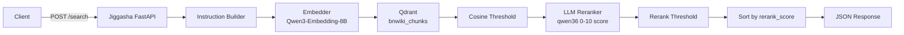
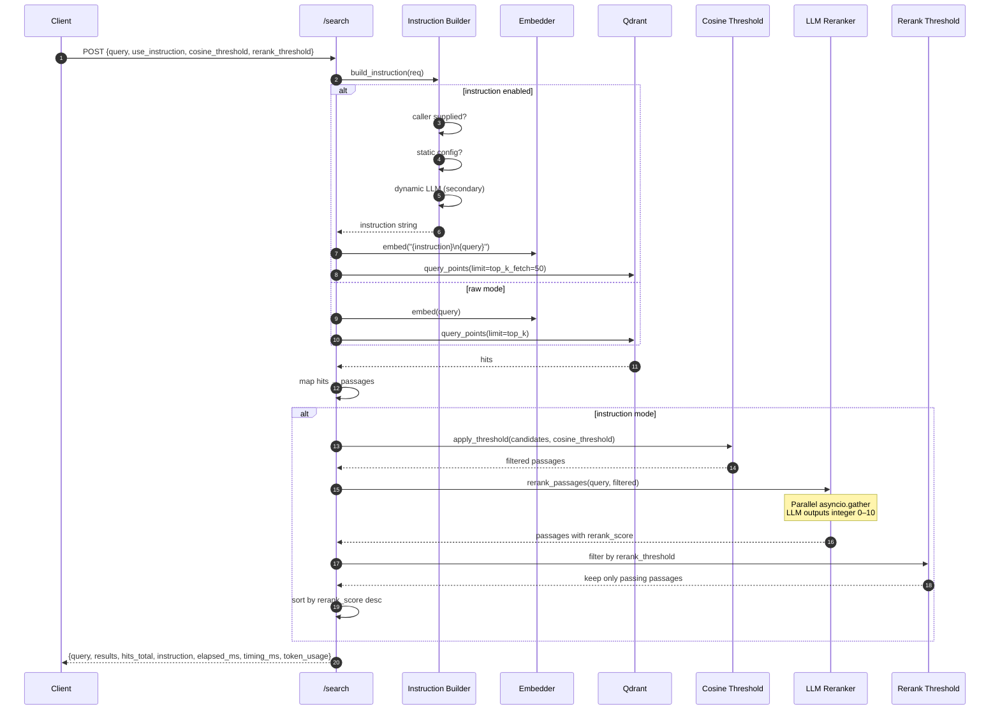
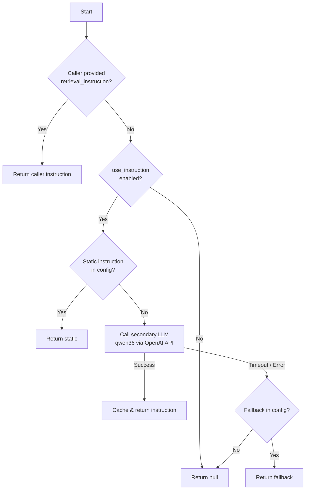
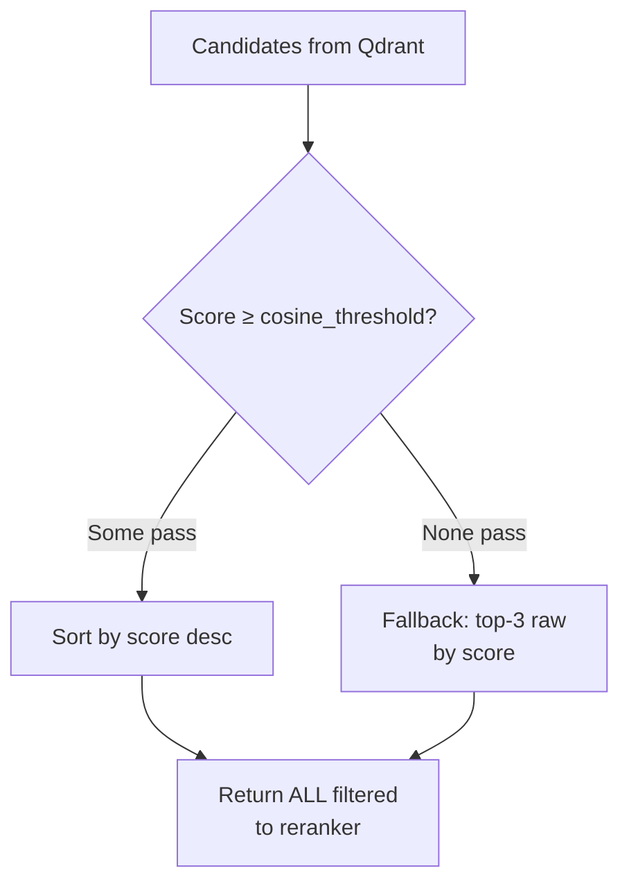
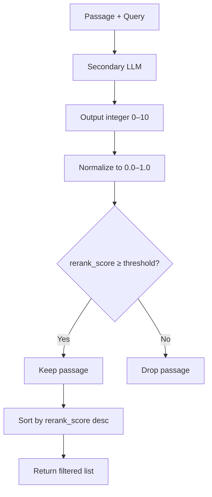

# Jiggasha — Bengali Passage Retrieval Service

FastAPI micro-service that performs dense retrieval over a Qdrant vector collection of Bengali text chunks (primarily government-service and wiki content).  **Single-query only** — each request carries one query string.

The pipeline is:

**Embed → Qdrant cosine search → threshold filter → LLM cross-encoder rerank → rerank-score filter → sorted results**

---

## Table of Contents

- [Health Check & Configuration](#health-check--configuration)
- [Input / Output Contract](#input--output-contract)
- [Architecture & Data Flow](#architecture--data-flow)
  - [Overview](#overview)
  - [Single-Query Flow](#single-query-flow)
  - [Instruction Generation](#instruction-generation)
  - [Threshold Filter](#threshold-filter)
  - [LLM Cross-Encoder Reranker](#llm-cross-encoder-reranker)
- [How Results Are Sent and Kept](#how-results-are-sent-and-kept)
- [Test Results](#test-results)

---

## Health Check & Configuration

### Environment variables (all present and reachable)

| Variable | Status | Notes |
|----------|--------|-------|
| `EMBEDDER_URL` | ✅ SET | vLLM / embedding endpoint |
| `EMBEDDER_API_KEY` | ✅ SET | Auth header token |
| `EMBEDDER_MODEL` | ✅ SET | e.g. `Qwen3-Embedding-8B` |
| `QDRANT_URL` | ✅ SET | Qdrant REST API |
| `SECONDARY_BASE_URL` | ✅ SET | vLLM / OpenAI-compatible chat endpoint |
| `SECONDARY_API_KEY` | ✅ SET | Auth token for secondary LLM |
| `SECONDARY_MODEL_NAME` | ✅ SET | e.g. `qwen36` |

### Service reachability

| Backend | Status | Detail |
|---------|--------|--------|
| **Embedder** | ✅ OK | Returns 4096-dim vectors |
| **Qdrant** | ✅ OK | Host alive |
| **Secondary LLM** | ✅ OK | `qwen36` responsive |

### Qdrant collection

| Property | Value |
|----------|-------|
| Configured collection | `bnwiki_chunks` |
| Exists | ✅ Yes |
| Points | **932,788** |
| Vector size | 4096 |
| Distance | Cosine |

> **Clean-up:** All other collections have been deleted from Qdrant.  `bnwiki_chunks` is the sole retrieval target.

### Config file (`config.yml`) sanity

- `embedder.dimension` = 4096 ✅ (matches actual vector size)
- `qdrant.distance` = Cosine ✅ (matches collection config)
- `retrieval.cosine_threshold` = 0.70
- `retrieval.top_k_fetch` = 50 (candidates fetched *before* threshold / rerank)

---

## Input / Output Contract

### `POST /search` — Single-query

**Request**

```json
{
  "query": "এনআইডি কার্ডের স্ট্যাটাস কিভাবে জানব?",
  "top_k": 20,
  "retrieval_instruction": null,
  "use_instruction": true,
  "cosine_threshold": 0.70,
  "rerank_threshold": 0.50
}
```

**Response**

```json
{
  "query": "এনআইডি কার্ডের স্ট্যাটাস কিভাবে জানব?",
  "results": [
    {
      "passage_id": 1898059397,
      "text": "...",
      "category": "...",
      "sub_category": "...",
      "service": "...",
      "topic": "...",
      "chunk_type": "govt_service",
      "llm_token_count": 1167,
      "score": 0.793,
      "rerank_score": 1.0
    }
  ],
  "hits_total": 6,
  "instruction": "Retrieve passages about checking the status of a National ID...",
  "elapsed_ms": 1233,
  "timing_ms": {
    "instruction": 590,
    "embedding": 46,
    "qdrant": 40,
    "rerank": 557
  },
  "token_usage": {
    "instruction_prompt": 0,
    "instruction_completion": 0,
    "rerank_prompt": 8845,
    "rerank_completion": 6
  }
}
```

### `GET /health`

Returns JSON with `qdrant`, `embedder`, and `secondary_llm` sub-objects.

---

## Architecture & Data Flow

### Overview



### Single-Query Flow



### Instruction Generation

Priority (highest → lowest):

1. `req.retrieval_instruction` (caller override)
2. Static instruction from `config.yml` (`static_instruction`)
3. Dynamic LLM-generated instruction (secondary LLM, ~5 s timeout)
4. Fallback instruction from `config.yml` (`fallback_instruction`)
5. `null` → raw query embedding (no instruction prefix)



### Threshold Filter

**No token budget cut.** All candidates that pass the cosine threshold are forwarded to the reranker.



| Rule | Behaviour |
|------|-----------|
| Cosine threshold | Default `0.70`.  Drops anything below it. |
| Empty threshold pass | Falls back to top-3 raw candidates. |
| Token budget | **Removed.** All threshold-passing candidates go to reranker. |

### LLM Cross-Encoder Reranker

The secondary LLM (`qwen36`) acts as a relevance scorer.  Each (query, passage) pair is evaluated in **parallel via `asyncio.gather`**.

**Prompt design (caching-friendly)**

- A long, detailed system prompt is reused for every call → vLLM prefix cache hit.
- Only the user message (query + passage text) changes per call.
- The model outputs a **single integer 0–10**.
- We normalize to `rerank_score = integer / 10.0` (continuous 0.0–1.0).

**Breadcrumb awareness**

The system prompt explicitly instructs the model to examine the breadcrumb header (e.g., `Category > Sub-category > Service`) at the start of each passage.  If the breadcrumb indicates a different specific topic than the query, the passage gets a low score — this directly addresses off-topic retrievals like *"বাংলাদেশ ফিল্ড হাসপাতাল"* for a liberation-war query.

**Rerank threshold**

After reranking, only passages with `rerank_score ≥ rerank_threshold` (default **0.50**) are returned.  This is the final quality gate.



---

## How Results Are Sent and Kept

### Returned to caller

- `results` list with passage metadata plus **`rerank_score`** (0.0–1.0):
  - `score` — original Qdrant cosine score
  - `rerank_score` — LLM-based relevance score
- `instruction` — the retrieval instruction used (if any)
- `elapsed_ms` — total request latency
- `timing_ms` — breakdown: `instruction`, `embedding`, `qdrant`, `rerank`
- `token_usage` — prompt / completion token counts for reranker

### No server-side persistence

The service is **stateless**.  Nothing is stored in a database or session store.

---

## Test Results

Raw retrieval tests were executed on **2026-06-03** and saved under:

```
data_exp/20260603T224724Z/raw_retrieval_tests.json
```

The file contains 10 test cases covering:

| Mode | Description |
|------|-------------|
| `single_instruction_rerank` | 5 Bengali queries with dynamic LLM instruction + cosine threshold 0.70 + LLM rerank + default rerank threshold 0.50 |
| `single_raw` | 3 queries without instruction (raw cosine, no rerank) |
| `single_caller_instruction` | 1 query with caller-supplied override instruction + rerank |
| `single_high_rerank_threshold` | 1 query with `rerank_threshold=0.90` |

### Sample metrics observed

| Query | Mode | Hits | Top Cosine | Top Rerank | Total ms | Rerank ms |
|-------|------|------|------------|------------|----------|-----------|
| এনআইডি কার্ডের স্ট্যাটাস | instruction + rerank | 6 | 0.793 | 1.000 | 1,233 | ~500 |
| পাসপোর্ট করার নিয়ম | instruction + rerank | 2 | 0.730 | 1.000 | 527 | ~200 |
| স্বাধীনতা যুদ্ধ কবে শুরু | instruction + rerank | 11 | 0.830 | 1.000 | 1,234 | ~600 |
| জন্ম সনদ প্রক্রিয়া | instruction + rerank | 3 | 0.717 | 1.000 | 592 | ~300 |
| মেট্রোরেলের ভাড়া | instruction + rerank | 3 | 0.839 | 1.000 | 764 | ~400 |

### Reranker quality observations

- **Automatic off-topic suppression:** The liberation-war query fetched 12 cosine candidates; the reranker scored 1 of them below 0.50, so it was dropped. The remaining 11 all scored 1.0.
- **Metro rail query:** 5 candidates passed cosine threshold; the reranker dropped 2 off-topic ones, leaving 3 high-quality results.
- **High threshold test:** With `rerank_threshold=0.90`, a passport query returned only 2 passages, both scoring 1.0 — extremely precise.

---

## Running the service

```bash
cd /home/vpa/CogOpsCB/jiggasha
python3 service.py              # default port 10000
python3 service.py --port 8080
```

Systemd unit file: `jiggasha-search.service`
